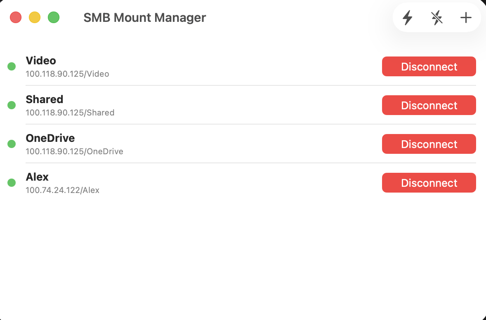
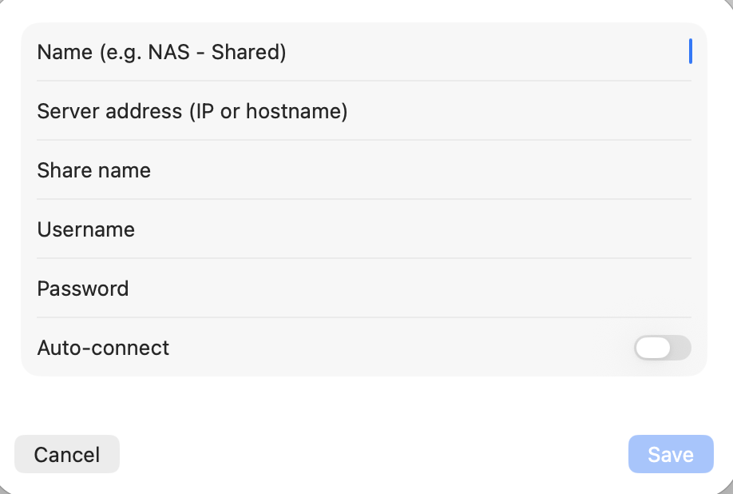

# SMB Mount Manager

A native macOS application for managing SMB network share connections. Easily mount, unmount, and auto-reconnect to file servers with secure credential storage.

## Features

- **Connection Management** — Add, edit, and delete SMB connections with a clean native interface
- **One-Click Mount/Unmount** — Connect or disconnect individual shares instantly
- **Bulk Operations** — Connect all or disconnect all shares from the toolbar
- **Auto-Connect** — Automatically reconnect to selected shares every 30 seconds when they drop
- **Real-Time Status Monitoring** — Connection status refreshes every 15 seconds with color-coded indicators:
  - Green: Connected
  - Yellow: Connecting
  - Red: Disconnected
  - Orange: Error
- **Secure Credential Storage** — Passwords are stored exclusively in the macOS Keychain, never written to disk
- **Network Discovery** — Automatically discover SMB servers on the local network via Bonjour (`_smb._tcp`). Select a discovered host to pre-fill the connection form
- **Share Discovery** — Query the list of available shares on a server directly from the connection form using `smbutil`
- **Diagnostics Console** — Built-in log viewer with four visibility modes (Hidden, Errors Only, Standard, All). Logs can be copied to clipboard or cleared

## Screenshots

### Main Window


The main window displays all configured SMB connections in a clean list. Each row shows the connection name, server path, and a color-coded status indicator (green = connected). The toolbar provides quick actions: **Connect All** (bolt icon), **Disconnect All** (bolt slash icon), and **Add Connection** (+). Each connection has a dedicated **Disconnect/Connect** button for individual control.

### Add / Edit Connection


The connection form allows you to configure all the details for an SMB share: a friendly display name, the server address (IP or hostname), the share name, and authentication credentials. The **Auto-connect** toggle enables automatic reconnection every 30 seconds when the share drops. Passwords are securely stored in the macOS Keychain and never written to disk. The **Share Discovery** section lets you query available shares on the server using the current credentials.

## Requirements

- **macOS 13.0** (Ventura) or later
- **Xcode 15.0** or later (to build from source)
- Network access to one or more SMB file servers

## Installation

### Build from Source

1. Clone the repository:
   ```bash
   git clone <repository-url>
   cd SAMBA
   ```

2. Open the Xcode project:
   ```bash
   open SMBMountManager/SMBMountManager.xcodeproj
   ```

3. In Xcode, select your signing team under **Signing & Capabilities**.

4. Build and run with **Cmd+R**, or archive for a release build via **Product → Archive**.

> **Note:** The project uses only native Apple frameworks — no external dependencies or package managers are required.

## Usage

### Adding a Connection

1. Click the **+** button in the toolbar.
2. Fill in the connection details:
   - **Name** — A display label (e.g., "NAS - Shared"). Optional; defaults to the share name if left empty.
   - **Server address** — IP address or hostname of the SMB server.
   - **Share name** — The name of the shared folder on the server.
   - **Username** — Your SMB account username.
   - **Password** — Your SMB account password (stored in Keychain).
3. Optionally click **Discover Shares** to list the shares available on the server (requires server, username, and password to be filled in). Select a share from the dropdown to auto-fill the share name.
4. Optionally enable **Auto-connect** to automatically reconnect when the share drops.
5. Click **Save**.

### Discovering SMB Servers

1. Click the **network** icon in the toolbar to open the Discovery panel.
2. The app automatically scans the local network for SMB servers published via Bonjour.
3. Click **Use** next to a discovered server to pre-fill the connection form with its hostname.
4. Click **Refresh** to re-scan the network.

### Diagnostics Console

1. Click the **text** icon in the toolbar to open the Diagnostics Console.
2. Use the segmented control to switch between visibility modes:
   - **Hidden** — No logs displayed
   - **Errors Only** — Only error-level entries
   - **Standard** — Errors, warnings, and info (default)
   - **All** — Includes debug-level entries
3. Click **Copy Logs** to copy all entries to the clipboard in ISO 8601 format.
4. Click **Clear** to remove all recorded entries.

### Connecting and Disconnecting

- Click the **Connect** button on any row to mount that share.
- Click the **Disconnect** button on a connected share to unmount it.
- Use the **bolt** toolbar button to connect all shares at once.
- Use the **bolt slash** toolbar button to disconnect all shares at once.

### Editing a Connection

Click on any connection row to open the edit sheet with pre-filled values, including the stored password.

### Deleting a Connection

Swipe left on a connection row to delete it. This also removes the associated password from the Keychain.

### Auto-Connect

When enabled for a connection, the app automatically attempts to mount the share every 30 seconds if it is not already connected.

## Data Storage

| Data | Location | Format |
|------|----------|--------|
| Connections (metadata) | `~/Library/Application Support/SMBMountManager/connections.json` | JSON |
| Passwords | macOS Keychain (service: `com.smb-mount-manager`) | Encrypted |
| Log visibility mode | `UserDefaults` (key: `logVisibilityMode`) | String |

- Passwords are **never** written to the JSON file — only the connection metadata (name, server, share, username, auto-connect flag) is persisted.
- Deleting a connection also removes its Keychain entry.

## Project Structure

```
SAMBA/
├── SMBMountManager/
│   ├── SMBMountManager/
│   │   ├── SMBMountManagerApp.swift        # App entry point (@main)
│   │   ├── Models/
│   │   │   └── SMBConnection.swift         # Data model + ConnectionStatus enum
│   │   ├── Views/
│   │   │   ├── ContentView.swift           # Main window with connection list
│   │   │   ├── ConnectionRow.swift         # Individual connection row component
│   │   │   ├── ConnectionEditView.swift    # Add/edit connection form + share discovery
│   │   │   ├── DiscoveryView.swift         # Bonjour SMB server discovery panel
│   │   │   └── DiagnosticsConsoleView.swift # Diagnostics log viewer
│   │   ├── Services/
│   │   │   ├── MountService.swift          # Mount, unmount, and status monitoring
│   │   │   ├── KeychainService.swift       # Secure password CRUD via Keychain
│   │   │   ├── PersistenceService.swift    # JSON file persistence
│   │   │   ├── LoggingService.swift        # Centralized logging with severity/category
│   │   │   ├── SMBDiscoveryService.swift   # Bonjour network browser for SMB hosts
│   │   │   └── SMBShareDiscoveryService.swift # Share enumeration via smbutil
│   │   ├── Assets.xcassets/                # App icon assets
│   │   ├── Info.plist                      # Bonjour service declarations
│   │   └── SMBMountManager.entitlements    # Network client entitlement
│   ├── SMBMountManager.xcodeproj/          # Xcode project configuration
│   └── generate_icon.py                    # App icon generation script
├── ARCHITECTURE.md                         # Technical architecture reference
└── README.md                               # This file
```

For a detailed technical overview, see [ARCHITECTURE.md](ARCHITECTURE.md).

## Icon Generation

The `generate_icon.py` script generates all required macOS app icon sizes. It requires **Python 3** and the **Pillow** library:

```bash
pip install Pillow
cd SMBMountManager
python3 generate_icon.py
```

This produces icon PNGs at all standard macOS sizes (16×16 through 512×512, at 1× and 2× scales) and updates `Contents.json` in the asset catalog.

## Contributing

1. Fork the repository.
2. Create a feature branch (`git checkout -b feature/my-feature`).
3. Make your changes, following the existing code style (SwiftUI, MVVM, `@MainActor` for services).
4. Commit your changes and push to your fork.
5. Open a pull request.

## License

This project is licensed under the MIT License — see the [LICENSE](LICENSE) file for details.
